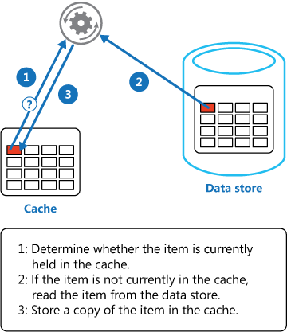

# Cache-Aside Pattern

[](https://msdn.microsoft.com/en-us/library/dn600223.aspx)  [](../)

Load data on demand into a cache from a data store. This pattern can improve performance and also helps to maintain consistency between data held in the cache and the data in the underlying data store.

## Context and Problem

Applications use a cache to optimize repeated access to information held in a data store. However, it is usually impractical to expect that cached data will always be completely consistent with the data in the data store. Applications should implement a strategy that helps to ensure that the data in the cache is up to date as far as possible, but can also detect and handle situations that arise when the data in the cache has become stale.

## Solution

Many commercial caching systems provide read-through and write-through/write-behind operations. In these systems, an application retrieves data by referencing the cache. If the data is not in the cache, it is transparently retrieved from the data store and added to the cache. Any modifications to data held in the cache are automatically written back to the data store as well.

For caches that do not provide this functionality, it is the responsibility of the applications that use the cache to maintain the data in the cache.

An application can emulate the functionality of read-through caching by implementing the cache-aside strategy. This strategy effectively loads data into the cache on demand. Figure 1 summarizes the steps in this process.



Figure 1 - Using the Cache-Aside pattern to store data in the cache

If an application updates information, it can emulate the write-through strategy as follows:

1.	Make the modification to the data store
2.	Invalidate the corresponding item in the cache.

When the item is next required, using the cache-aside strategy will cause the updated data to be retrieved from the data store and added back into the cache.

## Issues and Considerations

Consider the following points when deciding how to implement this pattern:

*	Lifetime of Cached Data. Many caches implement an expiration policy that causes data to be invalidated and removed from the cache if it is not accessed for a specified period. For cache-aside to be effective, ensure that the expiration policy matches the pattern of access for applications that use the data. Do not make the expiration period too short because this can cause applications to continually retrieve data from the data store and add it to the cache. Similarly, do not make the expiration period so long that the cached data is likely to become stale. Remember that caching is most effective for relatively static data, or data that is read frequently.
*	Evicting Data. Most caches have only a limited size compared to the data store from where the data originates, and they will evict data if necessary. Most caches adopt a least-recently-used policy for selecting items to evict, but this may be customizable. Configure the global expiration property and other properties of the cache, and the expiration property of each cached item, to help ensure that the cache is cost effective. It may not always be appropriate to apply a global eviction policy to every item in the cache. For example, if a cached item is very expensive to retrieve from the data store, it may be beneficial to retain this item in cache at the expense of more frequently accessed but less costly items.
*	Priming the Cache. Many solutions prepopulate the cache with the data that an application is likely to need as part of the startup processing. The Cache-Aside pattern may still be useful if some of this data expires or is evicted.
Consistency. Implementing the Cache-Aside pattern does not guarantee consistency between the data store and the cache. An item in the data store may be changed at any time by an external process, and this change might not be reflected in the cache until the next time the item is loaded into the cache. In a system that replicates data across data stores, this problem may become especially acute if synchronization occurs very frequently.
*	Local (In-Memory) Caching. A cache could be local to an application instance and stored in-memory. Cache-aside can be useful in this environment if an application repeatedly accesses the same data. However, a local cache is private and so different application instances could each have a copy of the same cached data. This data could quickly become inconsistent between caches, so it may be necessary to expire data held in a private cache and refresh it more frequently. In these scenarios it may be appropriate to investigate the use of a shared or a distributed caching mechanism.

## When to Use this Pattern

Use this pattern when:

*	A cache does not provide native read-through and write-through operations.
*	Resource demand is unpredictable. This pattern enables applications to load data on demand. It makes no assumptions about which data an application will require in advance.

This pattern might not be suitable:

*	When the cached data set is static. If the data will fit into the available cache space, prime the cache with the data on startup and apply a policy that prevents the data from expiring.
*	For caching session state information in a web application hosted in a web farm. In this environment, you should avoid introducing dependencies based on client-server affinity.

## Example
In Microsoft Azure you can use Azure Cache to create a distributed cache that can be shared by multiple instances of an application. The GetMyEntityAsync method in the following code example shows an implementation of the Cache-aside pattern based on Azure Cache. This method retrieves an object from the cache using the read-though approach.

An object is identified by using an integer ID as the key. The GetMyEntityAsync method generates a string value based on this key (the Azure Cache API uses strings for key values) and attempts to retrieve an item with this key from the cache. If a matching item is found, it is returned. If there is no match in the cache, the GetMyEntityAsync method retrieves the object from a data store, adds it to the cache, and then returns it (the code that actually retrieves the data from the data store has been omitted because it is data store dependent). Note that the cached item is configured to expire in order to prevent it from becoming stale if it is updated elsewhere.

```csharp
private DataCache cache;
...

public async Task<MyEntity> GetMyEntityAsync(int id)
{  
  // Define a unique key for this method and its parameters.
  var key = string.Format("StoreWithCache_GetAsync_{0}", id);
  var expiration = TimeSpan.FromMinutes(3);
  bool cacheException = false;

  try
  {
    // Try to get the entity from the cache.
    var cacheItem = cache.GetCacheItem(key);
    if (cacheItem != null)
    {
      return cacheItem.Value as MyEntity;
    }
  }
  catch (DataCacheException)
  {
    // If there is a cache related issue, raise an exception 
    // and avoid using the cache for the rest of the call.
    cacheException = true;
  }

  // If there is a cache miss, get the entity from the original store and cache it.
  // Code has been omitted because it is data store dependent.  
  var entity = ...;

  if (!cacheException)
  {
    try
    {
      // Avoid caching a null value.
      if (entity != null)
      {
        // Put the item in the cache with a custom expiration time that 
        // depends on how critical it might be to have stale data.
        cache.Put(key, entity, timeout: expiration);
      }
    }
    catch (DataCacheException)
    {
      // If there is a cache related issue, ignore it
      // and just return the entity.
    }
  }

  return entity;
}
```

**Note:**

> The examples use the Azure Cache API to access the store and retrieve information from the cache. For more information about the Azure Cache API, see Using Microsoft Azure Cache on MSDN.

The UpdateEntityAsync method shown below demonstrates how to invalidate an object in the cache when the value is changed by the application. This is an example of a write-through approach. The code updates the original data store and then removes the cached item from the cache by calling the Remove method, specifying the key (the code for this part of the functionality has been omitted as it will be data store dependent).

**NoteL**

> The order of the steps in this sequence is important. If the item is removed before the cache is updated, there is a small window of opportunity for a client application to fetch the data (because it is not found in the cache) before the item in the data store has been changed, resulting in the cache containing stale data.

```csharp
public async Task UpdateEntityAsync(MyEntity entity)
{
  // Update the object in the original data store
  await this.store.UpdateEntityAsync(entity).ConfigureAwait(false);

  // Get the correct key for the cached object.
  var key = this.GetAsyncCacheKey(entity.Id);

  // Then, invalidate the current cache object
  this.cache.Remove(key);
}

private string GetAsyncCacheKey(int objectId)
{
  return string.Format("StoreWithCache_GetAsync_{0}", objectId);
}
```

## Related Patterns and Guidance
The following patterns and guidance may also be relevant when implementing this pattern:

*	Caching Guidance. This guidance provides additional information on how you can cache data in a cloud solution, and the issues that you should consider when you implement a cache.
*	Data Consistency Primer. Cloud applications typically use data that is dispersed across data stores. Managing and maintaining data consistency in this environment can become a critical aspect of the system, particularly in terms of the concurrency and availability issues that can arise. This primer describes the issues surrounding consistency across distributed data, and summarizes how an application can implement eventual consistency to maintain the availability of data.

## More Information
The article Using Microsoft Azure Cache on MSDN.

Next Topic | Previous Topic | Home | Community


## patterns & practices