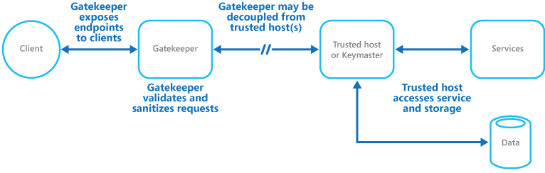

# Health Endpoint Monitoring Pattern

[](https://msdn.microsoft.com/en-us/library/dn600219.aspx)  [](https://msdn.microsoft.com/en-us/library/dn600218.aspx)  [](https://msdn.microsoft.com/en-us/library/dn600223.aspx)  [](http://code.msdn.microsoft.com/Health-Endpoint-Code-a7fe4fb6)  [](../)

Implement functional checks within an application that external tools can access through exposed endpoints at regular intervals. This pattern can help to verify that applications and services are performing correctly

## Context and Problem
It is good practice—and often a business requirement—to monitor web applications, and middle-tier and shared services, to ensure that they are available and performing correctly. However, it is more difficult to monitor services running in the cloud than it is to monitor on-premises services. For example, you do not have full control of the hosting environment, and the services typically depend on other services provided by platform vendors and others.

There are also many factors that affect cloud-hosted applications such as network latency, the performance and availability of the underlying compute and storage systems, and the network bandwidth between them. The service may fail entirely or partially due to any of these factors. Therefore, you must verify at regular intervals that the service is performing correctly to ensure the required level of availability—which might be part of your Service Level Agreement (SLA).

## Solution
Implement health monitoring by sending requests to an endpoint on the application. The application should perform the necessary checks, and return an indication of its status.

A health monitoring check typically combines two factors: the checks (if any) performed by the application or service in response to the request to the health verification endpoint, and analysis of the result by the tool or framework that is performing the health verification check. The response code indicates the status of the application and, optionally, any components or services it uses. The latency or response time check is performed by the monitoring tool or framework. Figure 1 shows an overview of the implementation of this pattern.

  
Figure 1 - Overview of the pattern

Additional checks that might be carried out by the health monitoring code in the application include:
* Checking cloud storage or a database for availability and response time.
* Checking other resources or services located within the application, or located elsewhere but used by the application.

Several existing services and tools are available for monitoring web applications by submitting a request to a configurable set of endpoints, and evaluating the results against a set of configurable rules. It is relatively easy to create a service endpoint whose sole purpose is to perform some functional tests on the system.

Typical checks that can be performed by the monitoring tools include:
* Validating the response code. For example, an HTTP Response of 200 (OK) indicates that the application responded without error. The monitoring system might also check for other response codes to give a more comprehensive indication of the result.
* Checking the content of the response to detect errors, even when a 200 (OK) status code is returned. This can detect errors that affect only a section of the returned web page or service response. For example, checking the title of a page or looking for a specific phrase that indicates the correct page was returned.
* Measuring the response time, which indicates a combination of the network latency and the time that the application took to execute the request. An increasing value may indicate an emerging problem with the application or network.
* Checking resources or services located outside the application, such as a content delivery network used by the application to deliver content from global caches.
* Checking for expiration of SSL certificates.
* Measuring the response time of a DNS lookup for the URL of the application in order to measure DNS latency and DNS failures.
* Validating the URL returned by the DNS lookup to ensure correct entries. This can help to avoid malicious request redirection through a successful attack on the DNS server.

It is also useful, where possible, to run these checks from different on-premises or hosted locations to measure and compare response times from different places. Ideally you should monitor applications from locations that are close to customers in order to get an accurate view of the performance from each location. In addition to providing a more robust checking mechanism, the results may influence the choice of deployment location for the application—and whether to deploy it in more than one datacenter.

Tests should also be run against all the service instances that customers use to ensure the application is working correctly for all customers. For example, if customer storage is spread across more than one storage account, the monitoring process must check all of these.

## Issues and Considerations
Consider the following points when deciding how to implement this pattern:
* How to validate the response. For example, is just a single a 200 (OK) status code sufficient to verify the application is working correctly? While this provides the most basic measure of application availability, and is the minimum implementation of this pattern, it provides little information about the operations, trends, and possible upcoming issues in the application.

**Note:**
> Make sure that the application does correctly return a 200 status code only when the target resource is found and processed. In some scenarios, such as when using a master page to host the target web page, the server may send back a 200 OK status code instead of a 404 Not Found code, even when the target content page was not found.

* The number of endpoints to expose for an application. One approach is to expose at least one endpoint for the core services the application uses and another for ancillary or lower priority services, allowing different levels of importance to be assigned to each monitoring result. Also consider exposing more endpoints, such as one for each core service, to provide additional monitoring granularity. For example, a health verification check might check the database, storage, and an external geocoding service an application uses; each requiring a different level of uptime and response time. The application may still be healthy if the geocoding service, or some other background task, is unavailable for a few minutes.
* Whether to use the same endpoint for monitoring as is used for general access, but to a specific path designed for health verification checks; for example, /HealthCheck/{GUID}/ on the general access endpoint. This allows some functional tests within the application to be executed by the monitoring tools, such as adding a new user registration, signing in, and placing a test order, while also verifying that the general access endpoint is available.
* The type of information to collect in the service in response to monitoring requests, and how to return this information. Most existing tools and frameworks look only at the HTTP status code that the endpoint returns. To return and validate additional information it may be necessary to create a custom monitoring utility or service.
* How much information to collect. Performing excessive processing during the check may overload the application and impact other users, and the time it takes may exceed the timeout of the monitoring system so that it marks the application as unavailable. Most applications include instrumentation such as error handlers and performance counters that log performance and detailed error information, and this may be sufficient instead of returning additional information from a health verification check.
* How to configure security for the monitoring endpoints to protect them from public access; which might expose the application to malicious attacks, risk the exposure of sensitive information, or attract denial of service (DoS) attacks. Typically this should be done in the application configuration so that it can be updated easily without restarting the application. Consider using one or more of the following techniques:
  * Secure the endpoint by requiring authentication. This may be achieved by using an authentication security key in the request header or by passing credentials with the request, provided that the monitoring service or tool supports authentication.
  * Use an obscure or hidden endpoint. For example, expose the endpoint on a different IP address to that used by the default application URL, configure the endpoint on a non-standard HTTP port, and/or use a complex path to the test page. It is usually possible to specify additional endpoint addresses and ports in the application configuration, and add entries for these endpoints to the DNS server if required to avoid having to specify the IP address directly.
  * Expose a method on an endpoint that accepts a parameter such as a key value or an operation mode value. Depending on the value supplied for this parameter when a request is received the code can perform a specific test or set of tests, or return a 404 (Not Found) error if the parameter value is not recognized. The recognized parameter values could be set in the application configuration.

**Note:**
> DoS attacks are likely to have less impact on a separate endpoint that performs basic functional tests without compromising the operation of the application. Ideally, avoid using a test that might expose sensitive information. If you must return any information that might be useful to an attacker, consider how you will protect the endpoint and the data from unauthorized access. In this case just relying on obscurity is not sufficient. You should also consider using an HTTPS connection and encrypting any sensitive data, although this will increase the load on the server.

* How to access an endpoint that is secured using authentication. Not all tools and frameworks can be configured to include credentials with the health verification request. For example, Microsoft Azure built-in health verification features cannot provide authentication credentials. Some third party alternatives that can are Pingdom, Panopta, NewRelic, and Statuscake.
* How to ensure that the monitoring agent is performing correctly. One approach is to expose an endpoint that simply returns a value from the application configuration or a random value that can be used to test the agent.

**Note:**
> Also ensure that the monitoring system performs checks on itself, such as a self-test and built-in test, to avoid it issuing false positive results.

## When to Use this Pattern
This pattern is ideally suited for:
* Monitoring websites and web applications to verify availability.
* Monitoring websites and web applications to check for correct operation.
* Monitoring middle-tier or shared services to detect and isolate a failure that could disrupt other applications.
* To complement existing instrumentation within the application, such as performance counters and error handlers. Health verification checking does not replace the requirement for logging and auditing in the application. Instrumentation can provide valuable information for an existing framework that monitors counters and error logs to detect failures or other issues. However, it cannot provide information if the application is unavailable.

## Example
The following code examples, taken from the **HealthCheckController** class in the **HealthEndpointMonitoring.Web** project that is included in the samples you can download for this guide, demonstrates exposing an endpoint for performing a range of health checks.

The **CoreServices** method, shown below, performs a series of checks on services used in the application. If all of the tests execute without error, the method returns a 200 (OK) status code. If any of the tests raises an exception, the method returns a 500 (Internal Error) status code. The method could optionally return additional information when an error occurs, if the monitoring tool or framework is able to make use of it.
```csharp
public ActionResult CoreServices()
{
  try
  {
    // Run a simple check to ensure the database is available.
    DataStore.Instance.CoreHealthCheck();

    // Run a simple check on our external service.
    MyExternalService.Instance.CoreHealthCheck();
  }
  catch (Exception ex)
  {
    Trace.TraceError("Exception in basic health check: {0}", ex.Message);

    // This can optionally return different status codes based on the exception.
    // Optionally it could return more details about the exception.
    // The additional information could be used by administrators who access the
    // endpoint with a browser, or using a ping utility that can display the
    // additional information.
    return new HttpStatusCodeResult((int)HttpStatusCode.InternalServerError);
  }
  return new HttpStatusCodeResult((int)HttpStatusCode.OK);
}
```
The **ObscurePath** method shows how you can read a path from the application configuration and use it as the endpoint for tests. This example also shows how you can accept an ID as a parameter and use it to check for valid requests.
```csharp
public ActionResult ObscurePath(string id)
{
  // The id could be used as a simple way to obscure or hide the endpoint.
  // The id to match could be retrieved from configuration and, if matched, 
  // perform a specific set of tests and return the result. It not matched it
  // could return a 404 Not Found status.

  // The obscure path can be set through configuration in order to hide the endpoint.
  var hiddenPathKey = CloudConfigurationManager.GetSetting("Test.ObscurePath");

  // If the value passed does not match that in configuration, return 403 "Not Found".
  if (!string.Equals(id, hiddenPathKey))
  {
    return new HttpStatusCodeResult((int)HttpStatusCode.NotFound);
  }

  // Else continue and run the tests...
  // Return results from the core services test.
  return this.CoreServices();
}
```
The **TestResponseFromConfig** method shows how you can expose an endpoint that performs a check for a specified configuration setting value.
```csharp
public ActionResult TestResponseFromConfig()
{
  // Health check that returns a response code set in configuration for testing.
  var returnStatusCodeSetting = CloudConfigurationManager.GetSetting(
                                                          "Test.ReturnStatusCode");

  int returnStatusCode;

  if (!int.TryParse(returnStatusCodeSetting, out returnStatusCode))
  {
    returnStatusCode = (int)HttpStatusCode.OK;
  }

  return new HttpStatusCodeResult(returnStatusCode);
}
```

# Monitoring Endpoints in Azure Hosted Applications
Some options for monitoring endpoints in Azure applications are:
* Use the built-in features of Microsoft Azure, such as the Management Services or Traffic Manager.
* Use a third party service or a framework such as Microsoft System Center Operations Manager.
* Create a custom utility or a service that runs on your own or on a hosted server.

**Note:**
> Even though Azure provides a reasonably comprehensive set of monitoring options, you may decide to use additional services and tools to provide extra information.

Azure Management Services provides a comprehensive built-in monitoring mechanism built around alert rules. The Alerts section of the Management Services page in the Azure management portal allows you to configure up to ten alert rules per subscription for your services. These rules specify a condition and a threshold value for a service such as CPU load, or the number of requests or errors per second, and the service can automatically send email notifications to addresses you define in each rule.

The conditions you can monitor vary depending on the hosting mechanism you choose for your application (such as Web Sites, Cloud Services, Virtual Machines, or Mobile Services), but all of these include the capability to create an alert rule that uses a web endpoint you specify in the settings for your service. This endpoint should respond in a timely way so that the alert system can detect that the application is operating correctly.

**Note:**
> For more information about creating monitoring alerts, see [Management Services](https://msdn.microsoft.com/en-us/library/windowsazure/dn306640.aspx) on MSDN.

If you host your application in Azure Cloud Services web and worker roles or Virtual Machines, you can take advantage of one of the built-in services in Azure called Traffic Manager. Traffic Manager is a routing and load-balancing service that can distribute requests to specific instances of your Cloud Services hosted application based on a range of rules and settings.

In addition to routing requests, Traffic Manager pings a URL, port, and relative path you specify on a regular basis to determine which instances of the application defined in its rules are active and are responding to requests. If it detects a status code 200 (OK) it marks the application as available, any other status code causes Traffic Manager to mark the application as offline. You can view the status in the Traffic Manager console, and configure the rule to reroute requests to other instances of the application that are responding.

However, keep in mind that Traffic Manager will only wait ten seconds to receive a response from the monitoring URL. Therefore, you should ensure that your health verification code executes within this timescale, allowing for network latency for the round trip from Traffic Manager to your application and back again.

**Note:**
> For more information about using Windows Traffic Manager to monitor your applications, see [Microsoft Azure Traffic Manager](https://msdn.microsoft.com/en-us/library/windowsazure/hh745750.aspx) on MSDN. Traffic Manager is also discussed in [Multiple Datacenter Deployment Guidance](https://msdn.microsoft.com/en-us/library/dn589779.aspx).

## Related Patterns and Guidance
The following guidance may also be relevant when implementing this pattern:
* [Instrumentation and Telemetry Guidance](https://msdn.microsoft.com/en-us/library/dn589775.aspx). Checking the health of services and components is typically done by probing, but it is also useful to have the appropriate information in place to monitor application performance and detect events that occur at runtime. This data can be transmitted back to monitoring tools to provide an additional feature for health monitoring. The Instrumentation and Telemetry guidance explores the process of gathering remote diagnostics information that is collected by instrumentation in applications.

## More Information
* Third-party tools [Pingdom](https://www.pingdom.com/), [Panopta](http://www.panopta.com/), [NewRelic](http://newrelic.com/), and [Statuscake](https://www.statuscake.com/).
* The article [Management Services](https://msdn.microsoft.com/en-us/library/windowsazure/dn306640.aspx) on MSDN.
* The article [Microsoft Azure Traffic Manager](https://msdn.microsoft.com/en-us/library/windowsazure/hh745750.aspx) on MSDN.

This pattern has a sample application associated with it. You can download the "Cloud Design Patterns – Sample Code" from the Microsoft Download Center at [http://aka.ms/cloud-design-patterns-sample](http://aka.ms/cloud-design-patterns-sample).
