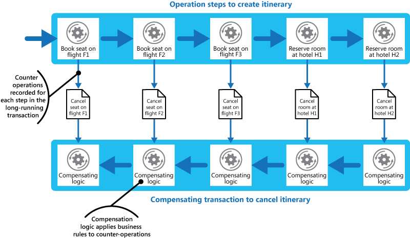

# Compensating Transaction Pattern

  

Undo the work performed by a series of steps, which together define an eventually consistent operation, if one or more of the steps fail. Operations that follow the eventual consistency model are commonly found in cloud-hosted applications that implement complex business processes and workflows.

## Context and Problem

Applications running in the cloud frequently modify data. This data may be spread across an assortment of data sources held in a variety of geographic locations. To avoid contention and improve performance in a distributed environment such as this, an application should not attempt to provide strong transactional consistency. Rather, the application should implement eventual consistency. In this model, a typical business operation consists of a series of autonomous steps. While these steps are being performed the overall view of the system state may be inconsistent, but when the operation has completed and all of the steps have been executed the system should become consistent again.

**Note:**

>The Data Consistency Primer provides more information about why distributed transactions do not scale well, and the principles that underpin the eventual consistency model.

A significant challenge in the eventual consistency model is how to handle a step that has failed irrecoverably. In this case it may be necessary to undo all of the work completed by the previous steps in the operation. However, the data cannot simply be rolled back because other concurrent instances of the application may have since changed it. Even in cases where the data has not been changed by a concurrent instance, undoing a step might not simply be a matter of restoring the original state. It may be necessary to apply various business-specific rules (see the travel website described in the Example section).

If an operation that implements eventual consistency spans several heterogeneous data stores, undoing the steps in such an operation will require visiting each data store in turn. The work performed in every data store must be undone reliably to prevent the system from remaining inconsistent.

Not all data affected by an operation that implements eventual consistency might be held in a database. In a Service Oriented Architecture (SOA) environment an operation may invoke an action in a service, and cause a change in the state held by that service. To undo the operation, this state change must also be undone. This may involve invoking the service again and performing another action that reverses the effects of the first.

## Solution

Implement a compensating transaction. The steps in a compensating transaction must undo the effects of the steps in the original operation. A compensating transaction might not be able to simply replace the current state with the state the system was in at the start of the operation because this approach could overwrite changes made by other concurrent instances of an application. Rather, it must be an intelligent process that takes into account any work done by concurrent instances. This process will usually be application-specific, driven by the nature of the work performed by the original operation.

A common approach to implementing an eventually consistent operation that requires compensation is to use a workflow. As the original operation proceeds, the system records information about each step and how the work performed by that step can be undone. If the operation fails at any point, the workflow rewinds back through the steps it has completed and performs the work that reverses each step. Note that a compensating transaction might not have to undo the work in the exact mirror-opposite order of the original operation, and it may be possible to perform some of the undo steps in parallel.

**Note:**
>This approach is similar to the Sagas strategy. A description of this strategy is available online in [Clemens Vasters’ blog](http://vasters.com/clemensv/2012/09/01/Sagas.aspx).

A compensating transaction is itself an eventually consistent operation and it could also fail. The system should be able to resume the compensating transaction at the point of failure and continue. It may be necessary to repeat a step that has failed, so the steps in a compensating transaction should be defined as idempotent commands. For more information about idempotency, see [Idempotency Patterns](http://blog.jonathanoliver.com/2010/04/idempotency-patterns/) on Jonathan Oliver’s blog.

In some cases it may not be possible to recover from a step that has failed except through manual intervention. In these situations the system should raise an alert and provide as much information as possible about the reason for the failure.

## Issues and Considerations

Consider the following points when deciding how to implement this pattern:

*	It might not be easy to determine when a step in an operation that implements eventual consistency has failed. A step might not fail immediately, but instead it could block. It may be necessary to implement some form of time-out mechanism.
*	Compensation logic is not easily generalized. A compensating transaction is application-specific; it relies on the application having sufficient information to be able to undo the effects of each step in a failed operation.
*	You should define the steps in a compensating transaction as idempotent commands. This enables the steps to be repeated if the compensating transaction itself fails.
*	The infrastructure that handles the steps in the original operation, and the compensating transaction, must be resilient. It must not lose the information required to compensate for a failing step, and it must be able to reliably monitor the progress of the compensation logic.
*	A compensating transaction does not necessarily return the data in the system to the state it was in at the start of the original operation. Instead, it compensates for the work performed by the steps that completed successfully before the operation failed.
*	The order of the steps in the compensating transaction does not necessarily have to be the mirror opposite of the steps in the original operation. For example, one data store may be more sensitive to inconsistencies than another, and so the steps in the compensating transaction that undo the changes to this store should occur first.
*	Placing a short-term timeout-based lock on each resource that is required to complete an operation, and obtaining these resources in advance, can help increase the likelihood that the overall activity will succeed. The work should be performed only after all the resources have been acquired. All actions must be finalized before the locks expire.
*	Consider using retry logic that is more forgiving than usual to minimize failures that trigger a compensating transaction. If a step in an operation that implements eventual consistency fails, try handling the failure as a transient exception and repeat the step. Only abort the operation and initiate a compensating transaction if a step fails repeatedly or irrecoverably.

**Note:**

>Many of the challenges and issues of implementing a compensating transaction are the same as those concerned with implementing eventual consistency. See the section Considerations for Implementing Eventual Consistency in the [Data Consistency Primer](https://msdn.microsoft.com/en-us/library/dn589800.aspx) for more information.

## When to Use this Pattern

Use this pattern only for operations that must be undone if they fail. If possible, design solutions to avoid the complexity of requiring compensating transactions (for more information, see the [Data Consistency Primer](https://msdn.microsoft.com/en-us/library/dn589800.aspx)).

## Example
A travel website enables customers to book itineraries. A single itinerary may comprise a series of flights and hotels. A customer traveling from Seattle to London and then on to Paris could perform the following steps when creating an itinerary:

1.	Book a seat on flight F1 from Seattle to London.
2.	Book a seat on flight F2 from London to Paris.
3.	Book a seat on flight F3 from Paris to Seattle.
4.	Reserve a room at hotel H1 in London.
5.	Reserve a room at hotel H2 in Paris.
	
These steps constitute an eventually consistent operation, although each step is essentially a separate atomic action in its own right. Therefore, as well as performing these steps, the system must also record the counter operations necessary to undo each step in case the customer decides to cancel the itinerary. The steps necessary to perform the counter operations can then run as a compensating transaction if necessary.

Notice that the steps in the compensating transaction might not be the exact opposite of the original steps, and the logic in each step in the compensating transaction must take into account any business-specific rules. For example, “unbooking” a seat on a flight might not entitle the customer to a complete refund of any money paid.

Figure 1 - Generating a compensating transaction to undo a long-running transaction to book a travel itinerary

**Note:**

>It may be possible for the steps in the compensating transaction to be performed in parallel, depending on how you have designed the compensating logic for each step.

In many business solutions, failure of a single step does not always necessitate rolling the system back by using a compensating transaction. For example, if—after having booked flights F1, F2, and F3 in the travel website scenario—the customer is unable to reserve a room at hotel H1, it is preferable to offer the customer a room at a different hotel in the same city rather than cancelling the flights. The customer may still elect to cancel (in which case the compensating transaction runs and undoes the bookings made on flights F1, F2, and F3), but this decision should be made by the customer rather than by the system.

## Related Patterns and Guidance

The following patterns and guidance may also be relevant when implementing this pattern:

*	Data Consistency Primer. The Compensating Transaction pattern is frequently used to undo operations that implement the eventual consistency model. This primer provides more information on the benefits and tradeoffs of eventual consistency.
*	Scheduler-Agent-Supervisor Pattern. This pattern describes how to implement resilient systems that perform business operations that utilize distributed services and resources. In some circumstances, it may be necessary to undo the work performed by an operation by using a compensating transaction.
*	Retry Pattern. Compensating transactions can be expensive to perform, and it may be possible to minimize their use by implementing an effective policy of retrying failing operations by following the Retry pattern.

## More Information

*	The article Sagas on Clemens Vasters’ blog.
*	The article Idempotency Patterns on Jonathan Oliver’s blog.