# Cloud Design Patterns: Prescriptive Architecture Guidance for Cloud Applications

January 2014

Containing twenty-four [design patterns](#design-patterns) and ten related [guidance](#guidance) topics, this guide articulates the benefit of applying patterns by showing how each piece can fit into the big picture of cloud application architectures. It also discusses the benefits and considerations for each pattern. Most of the patterns have [code samples](https://msdn.microsoft.com/en-us/library/dn622075.aspx) or snippets that show how to implement the patterns using the features of Microsoft Azure. However the majority of topics described in this guide are equally relevant to all kinds of distributed systems, whether hosted on Azure or on other cloud platforms.

* [Download book (PDF)](https://www.microsoft.com/en-us/download/details.aspx?id=42026)
* [Download code samples](http://aka.ms/Cloud-Design-Patterns-Sample)
* [Order paperback](http://amzn.to/NCRXr2)
* [Download poster](http://azure.microsoft.com/en-us/documentation/infographics/cloud-design-patterns/)

# Design Patterns

The following design patterns are useful in cloud-hosted applications. Each pattern is provided in a common format that describes the context and problem, the solution, issues and considerations for applying the pattern, and an example based on Azure. Each pattern also includes links to other related patterns. The icons at the top of each item represent the [problem areas](https://msdn.microsoft.com/en-us/library/dn589772.aspx#Categoryofdesignpatterns) that it relates to. Some of the patterns have code samples. You can download all [code sample](https://msdn.microsoft.com/en-us/library/dn622075.aspx) at once or click the code samples icon  associated with the individual pattern to download only that sample.

**Note**

> Our intention is not to provide a comprehensive collection of patterns. Instead, we chose what we think are useful patterns for cloud applications—taking into account the popularity of each one amongst users. Neither is this a detailed guide to the features of Azure. To learn about Azure see [http://azure.microsoft.com](http://azure.microsoft.com).

## Cache-aside Pattern
    

Load data on demand into a cache from a data store. This pattern can improve performance and also helps to maintain consistency between data held in the cache and the data in the underlying data store.

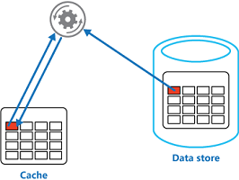

For more info, see the Cache-aside Pattern.

## Circuit Breaker Pattern
  

Handle faults that may take a variable amount of time to rectify when connecting to a remote service or resource. This pattern can improve the stability and resiliency of an application.

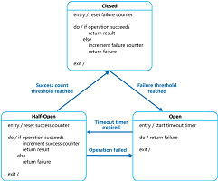

For more info, see the Circuit Breaker Pattern.

## Compensating Transaction Pattern
  

Undo the work performed by a series of steps, which together define an eventually consistent operation, if one or more of the operations fails. Operations that follow the eventual consistency model are commonly found in cloud-hosted applications that implement complex business processes and workflows.

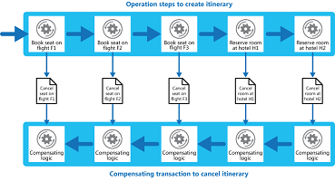

For more info, see the Compensating Transaction Pattern.

## Competing Consumers Pattern
      

Enable multiple concurrent consumers to process messages received on the same messaging channel. This pattern enables a system to process multiple messages concurrently to optimize throughput, to improve scalability and availability, and to balance the workload.

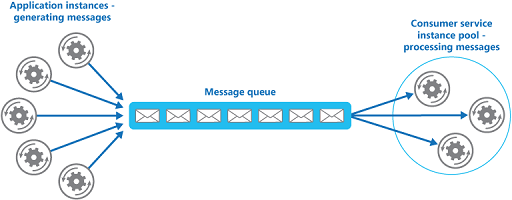

For more info, see the Competing Consumers Pattern.

## Compute Resource Consolidation Pattern
    

Consolidate multiple tasks or operations into a single computational unit. This pattern can increase compute resource utilization, and reduce the costs and management overhead associated with performing compute processing in cloud-hosted applications.

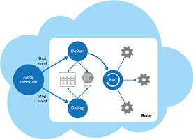

For more info, see the Compute Resource Consolidation Pattern.

## Command and Query Responsibility Segregation (CQRS) Pattern
      

Segregate operations that read data from operations that update data by using separate interfaces. This pattern can maximize performance, scalability, and security; support evolution of the system over time through higher flexibility; and prevent update commands from causing merge conflicts at the domain level.

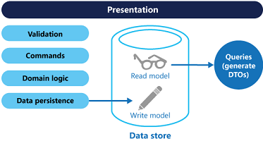

For more info, see the Command and Query Responsibility Segregation (CQRS) Pattern.

## Event Sourcing Pattern
    

Use an append-only store to record the full series of events that describe actions taken on data in a domain, rather than storing just the current state, so that the store can be used to materialize the domain objects. This pattern can simplify tasks in complex domains by avoiding the requirement to synchronize the data model and the business domain; improve performance, scalability, and responsiveness; provide consistency for transactional data; and maintain full audit trails and history that may enable compensating actions.

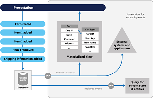

For more info, see the Event Sourcing Pattern.

## External Configuration Store Pattern
      

Move configuration information out of the application deployment package to a centralized location. This pattern can provide opportunities for easier management and control of configuration data, and for sharing configuration data across applications and application instances.

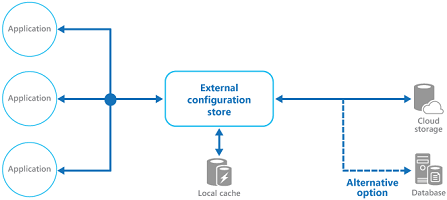

For more info, see the External Configuration Store Pattern.

## Federated Identity Pattern
  

Delegate authentication to an external identity provider. This pattern can simplify development, minimize the requirement for user administration, and improve the user experience of the application.

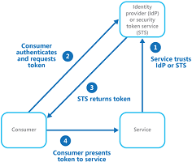

For more info, see the Federated Identity Pattern.

## [Gatekeeper Pattern](10.Gatekeeper Pattern.md)
  

Protect applications and services by using a dedicated host instance that acts as a broker between clients and the application or service, validates and sanitizes requests, and passes requests and data between them. This pattern can provide an additional layer of security, and limit the attack surface of the system.

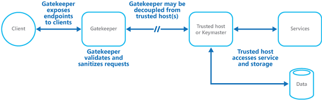

For more info, see the [Gatekeeper Pattern](10.Gatekeeper Pattern.md).

## Health Endpoint Monitoring Pattern
      

Implement functional checks within an application that external tools can access through exposed endpoints at regular intervals. This pattern can help to verify that applications and services are performing correctly.

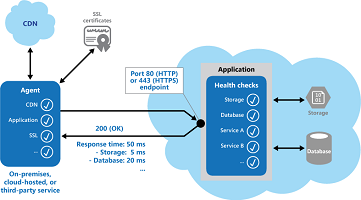

For more info, see the Health Endpoint Monitoring Pattern.

## Index Table Pattern
    

Create indexes over the fields in data stores that are frequently referenced by query criteria. This pattern can improve query performance by allowing applications to more quickly retrieve data from a data store.

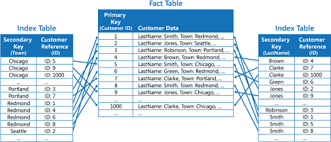

For more info, see the Index Table Pattern.

## Leader Election Pattern
      

Coordinate the actions performed by a collection of collaborating task instances in a distributed application by electing one instance as the leader that assumes responsibility for managing the other instances. This pattern can help to ensure that tasks do not conflict with each other, cause contention for shared resources, or inadvertently interfere with the work that other task instances are performing.

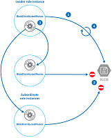

For more info, see the Leader Election Pattern.

## Materialized View Pattern
    

Generate pre-populated views over the data in one or more data stores when the data is formatted in a way that does not favor the required query operations. This pattern can help to support efficient querying and data extraction, and improve application performance.

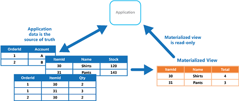

For more info, see the Materialized View Pattern.

## Pipes and Filters Pattern
      

Decompose a task that performs complex processing into a series of discrete elements that can be reused. This pattern can improve performance, scalability, and reusability by allowing task elements that perform the processing to be deployed and scaled independently.

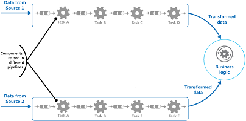

For more info, see the Pipes and Filters Pattern.

## Priority Queue Pattern
      

Prioritize requests sent to services so that requests with a higher priority are received and processed more quickly than those of a lower priority. This pattern is useful in applications that offer different service level guarantees to individual types of client.

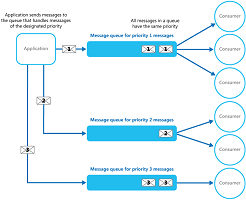

For more info, see the Priority Queue Pattern.

## Queue-based Load Leveling Pattern
      

Use a queue that acts as a buffer between a task and a service that it invokes in order to smooth intermittent heavy loads that may otherwise cause the service to fail or the task to timeout. This pattern can help to minimize the impact of peaks in demand on availability and responsiveness for both the task and the service.

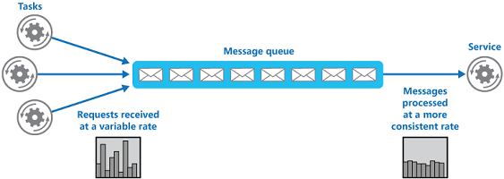

For more info, see the Queue-based Load Leveling Pattern.

## Retry Pattern
  

Enable an application to handle temporary failures when connecting to a service or network resource by transparently retrying the operation in the expectation that the failure is transient. This pattern can improve the stability of the application.

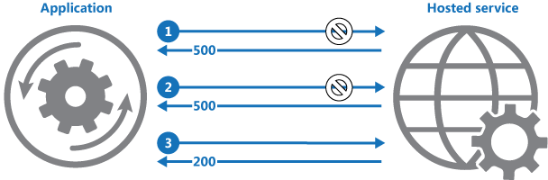

For more info, see the Retry Pattern.

## Runtime Reconfiguration Pattern
      

Design an application so that it can be reconfigured without requiring redeployment or restarting the application. This helps to maintain availability and minimize downtime.

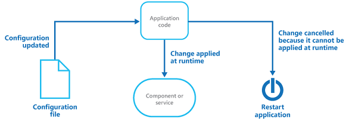

For more info, see the Runtime Reconfiguration Pattern.

## Scheduler Agent Supervisor Pattern
    

Coordinate a set of actions across a distributed set of services and other remote resources, attempt to transparently handle faults if any of these actions fail, or undo the effects of the work performed if the system cannot recover from a fault. This pattern can add resiliency to a distributed system by enabling it to recover and retry actions that fail due to transient exceptions, long-lasting faults, and process failures.

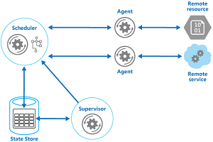

For more info, see the Scheduler Agent Supervisor Pattern.

## Sharding Pattern
    

Divide a data store into a set of horizontal partitions shards. This pattern can improve scalability when storing and accessing large volumes of data.

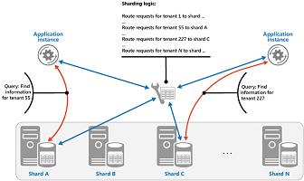

For more info, see the Sharding Pattern.

## Static Content Hosting Pattern
        

Deploy static content to a cloud-based storage service that can deliver these directly to the client. This pattern can reduce the requirement for potentially expensive compute instances.

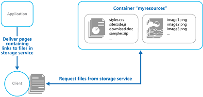

For more info, see the Static Content Hosting Pattern.

## Throttling Pattern
    

Control the consumption of resources used by an instance of an application, an individual tenant, or an entire service. This pattern can allow the system to continue to function and meet service level agreements, even when an increase in demand places an extreme load on resources.

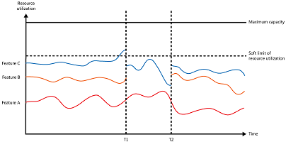

For more info, see the Throttling Pattern.

## Valet Key Pattern
      

Use a token or key that provides clients with restricted direct access to a specific resource or service in order to offload data transfer operations from the application code. This pattern is particularly useful in applications that use cloud-hosted storage systems or queues, and can minimize cost and maximize scalability and performance.

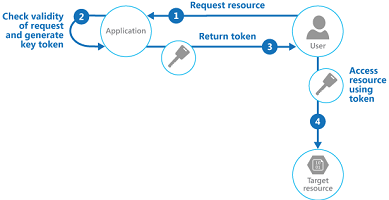

For more info, see the Valet Key Pattern.

# Guidance
The primer and guidance topics are related to specific areas of application development, such as caching, data partitioning, and autoscaling. The guide contains the following primers and guidance topics.

## Asynchronous Messaging Primer
  

Messaging is a key strategy employed in many distributed environments such as the cloud. It enables applications and services to communicate and cooperate, and can help to build scalable and resilient solutions. Messaging supports asynchronous operations, enabling you to decouple a process that consumes a service from the process that implements the service.

For more info, see Asynchronous Messaging Primer.

## Autoscaling Guidance
  

Constantly monitoring performance and scaling a system to adapt to fluctuating workloads to meet capacity targets and optimize operational cost can be a labor-intensive process. It may not be feasible to perform these tasks manually. This is where autoscaling is useful.

For more info, see Autoscaling Guidance.

## Caching Guidance
    

Caching is a common technique that aims to improve the performance and scalability of a system by temporarily copying frequently accessed data to fast storage located close to the application. Caching is most effective when an application instance repeatedly reads the same data, especially if the original data store is slow relative to the speed of the cache, it is subject to a high level of contention, or it is far away resulting in network latency.

For more info, see Caching Guidance.

## Compute Partitioning Guidance
  

When deploying an application to the cloud it may be desirable to allocate the services and components it uses in a way that helps to minimize running costs while maintaining the scalability, performance, availability, and security of the application.

For more info, see Compute Partitioning Guidance.

## Data Consistency Primer
    

Cloud applications typically use data that is dispersed across data stores. Managing and maintaining data consistency in this environment can become a critical aspect of the system, particularly in terms of the concurrency and availability issues that can arise. You frequently need to trade strong consistency for performance. This means that you may need to design some aspects of your solutions around the notion of eventual consistency and accept that the data that your applications use might not be completely consistent all of the time.

For more info, see Data Consistency Primer.

## Data Partitioning Guidance
    

In many large-scale solutions, data is divided into separate partitions that can be managed and accessed separately. The partitioning strategy must be chosen carefully to maximize the benefits while minimizing adverse effects. Partitioning can help to improve scalability, reduce contention, and optimize performance.

For more info, see Data Partitioning Guidance.

## Data Replication and Synchronization Guidance
    

When you deploy an application to more than one datacenter, such as cloud and on-premises locations, you must consider how you will replicate and synchronize the data each instance of the application uses in order to maximize availability and performance, ensure consistency, and minimize data transfer costs between locations.

For more info, see Data Replication and Synchronization Guidance.

## Instrumentation and Telemetry Guidance
  

Most applications will include diagnostics features that generate custom monitoring and debugging information, especially when an error occurs. This is referred to as instrumentation, and is usually implemented by adding event and error handling code to the application. The process of gathering remote information that is collected by instrumentation is usually referred to as telemetry.

For more info, see Instrumentation and Telemetry Guidance.

## Multiple Datacenter Deployment Guidance
  

Deploying an application to more than one datacenter can provide benefits such as increased availability and a better user experience across wider geographical areas. However, there are challenges that must be resolved, such as data synchronization and regulatory limitations.

For more info, see Multiple Datacenter Deployment Guidance.

## Service Metering Guidance
  

You may need to meter the use of applications or services in order to plan future requirements; to gain an understanding of how they are used; or to bill users, organization departments, or customers. This is a common requirement, particularly in large corporations and for independent software vendors and service providers.

For more info, see Service Metering Guidance.

# See Also

* [Problem Areas in the Cloud](https://msdn.microsoft.com/en-us/library/dn589772.aspx)
* [Code Samples](https://msdn.microsoft.com/en-us/library/dn622075.aspx)

# Feedback and Support
Questions? Comments? Suggestions? To provide feedback about this guide, or to get help with any problems, please visit our Community site at [http://wag.codeplex.com](http://wag.codeplex.com). The message board on the community site is the preferred feedback and support channel because it allows you to share your ideas, questions, and solutions with the entire community.
