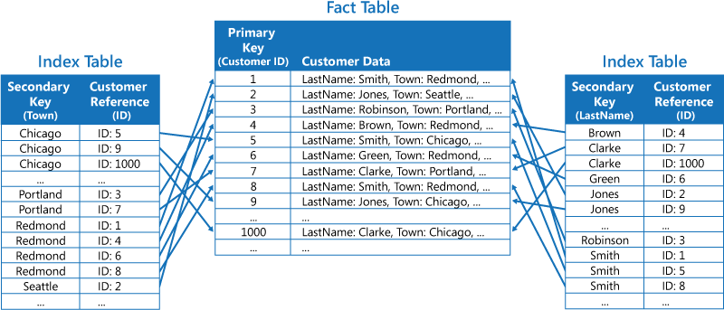

# 索引表模式

      

Create indexes over the fields in data stores that are frequently referenced by query criteria. This pattern can improve query performance by allowing applications to more quickly locate the data to retrieve from a data store.

## Context and Problem
Many data stores organize the data for a collection of entities by using the primary key. An application can use this key to locate and retrieve data. Figure 1 shows an example of a data store holding customer information. The primary key is the Customer ID.

  
Figure 1 - Customer information organized by the primary key (Customer ID)

While the primary key is valuable for queries that fetch data based on the value of this key, an application might not be able to use the primary key if it needs to retrieve data based on some other field. In the Customers example, an application cannot use the Customer ID primary key to retrieve customers if it queries data solely by specifying criteria that reference the value of some other attribute, such as the town in which the customer is located. To perform a query such as this may require the application to fetch and examine every customer record, and this could be a slow process.

Many relational database management systems support secondary indexes. A secondary index is a separate data structure that is organized by one or more non-primary (secondary) key fields, and it indicates where the data for each indexed value is stored. The items in a secondary index are typically sorted by the value of the secondary keys to enable fast lookup of data. These indexes are usually maintained automatically by the database management system.

You can create as many secondary indexes as are required to support the different queries that your application performs. For example, in a Customers table in a relational database where the customer ID is the primary key, it may be beneficial to add a secondary index over the town field if the application frequently looks up customers by the town in which they reside.

However, although secondary indexes are a common feature of relational systems, most NoSQL data stores used by cloud applications do not provide an equivalent feature.

## Solution
If the data store does not support secondary indexes, you can emulate them manually by creating your own index tables. An index table organizes the data by a specified key. Three strategies are commonly used for structuring an index table, depending on the number of secondary indexes that are required and the nature of the queries that an application performs:

* Duplicate the data in each index table but organize it by different keys (complete denormalization). Figure 2 shows index tables that organize the same customer information by Town and LastName:  
  
Figure 2 - Index tables implementing secondary indexes for customer data. The data is duplicated in each index table.  
This strategy may be appropriate if the data is relatively static compared to the number of times it is queried by using each key. If the data is more dynamic, the processing overhead of maintaining each index table may become too great for this approach to be useful. Additionally, if the volume of data is very large, the amount of space required to store the duplicate data will be significant.

* Create normalized index tables organized by different keys and reference the original data by using the primary key rather than duplicating it, as shown in Figure 3. The original data is referred to as a fact table:  
  
Figure 3 - Index tables implementing secondary indexes for customer data. The data is referenced by each index table.  
This technique saves space and reduces the overhead of maintaining duplicate data. The disadvantage is that an application has to perform two lookup operations to find data by using a secondary key (find the primary key for the data in the index table, and then look up the data in the fact table by using the primary key).

* Create partially normalized index tables organized by different keys that duplicate frequently retrieved fields. Reference the original data to access less frequently accessed fields. Figure 4 shows this structure.  
  
Figure 4 - Index tables implementing secondary indexes for customer data. Commonly accessed data is duplicated in each index table.  
Using this technique, you can strike a balance between the first two approaches. The data for common queries can be retrieved quickly by using a single lookup, while the space and maintenance overhead is not as great as duplicating the entire data set.

If an application frequently queries data by specifying a combination of values (for example, “Find all customers that live in Redmond and that have a last name of Smith”), you could implement the keys to the items in the index table as a concatenation of the Town attribute and the LastName attribute, as shown in Figure 5. The keys are sorted by Town, and then by LastName for records that have the same value for Town.  
  
Figure 5 - An index table based on composite keys

Index tables can speed up query operations over sharded data, and are especially useful where the shard key is hashed. Figure 6 shows an example where the shard key is a hash of the Customer ID. The index table can organize data by the non-hashed value (Town and LastName), and provide the hashed shard key as the lookup data. This can save the application from repeatedly calculating hash keys (which may be an expensive operation) if it needs to retrieve data that falls within a range, or it needs to fetch data in order of the non-hashed key. For example, a query such as “Find all customers that live in Redmond” can be quickly resolved by locating the matching items in the index table (which are all stored in a contiguous block), and then following the references to the customer data by using the shard keys stored in the index table.  
  
Figure 6 - An index table providing quick look up for sharded data

## Issues and Considerations
Consider the following points when deciding how to implement this pattern:

* The overhead of maintaining secondary indexes can be significant. You must analyze and understand the queries that your application uses. Only create index tables where they are likely to be used regularly. Do not create speculative index tables to support queries that an application does not perform, or that an application performs only very occasionally.
* Duplicating data in an index table can add a significant overhead in terms of storage costs and the effort required to maintain multiple copies of data.
* Implementing an index table as a normalized structure that references the original data may require an application to perform two lookup operations to find data. The first operation searches the index table to retrieve the primary key, and the second uses the primary key to fetch the data.
* If a system incorporates a number of index tables over very large data sets, it can be difficult to maintain consistency between index tables and the original data. It might be possible to design the application around the eventual consistency model. For example, to insert, update, or delete data, an application could post a message to a queue and let a separate task perform the operation and maintain the index tables that reference this data asynchronously. For more information about implementing eventual consistency, see the [Data Consistency primer](https://msdn.microsoft.com/en-us/library/dn589800.aspx).

**Note:**

> Microsoft Azure storage tables support transactional updates for changes made to data held in the same partition (referred to as entity group transactions). If you can store the data for a fact table and one or more index tables in the same partition, you may be able to use this feature to help ensure consistency.

* Index tables may themselves be partitioned or sharded.

## When to Use this Pattern
Use this pattern to improve query performance when an application frequently needs to retrieve data by using a key other than the primary (or shard) key.

This pattern might not be suitable when:

* Data is volatile. An index table may become out of date very quickly, rendering it ineffective or making the overhead of maintaining the index table greater than any savings made by using it.
* A field selected as the secondary key for an index table is very non-discriminating and can only have a small set of values (for example, gender).
* The balance of the data values for a field selected as the secondary key for an index table are highly skewed. For example, if 90% of the records contain the same value in a field, then creating and maintaining an index table to look up data based on this field may exert more overhead than scanning sequentially through the data. However, if queries very frequently target values that lie in the remaining 10%, this index may be useful. You must understand the queries that your application is performing, and how frequently they are performed.

## Example
Azure storage tables provide a highly scalable key/value data store for applications running in the cloud. Applications store and retrieve data values by specifying a key. The data values can contain multiple fields, but the structure of a data item is opaque to table storage, which simply handles a data item as an array of bytes.

Azure storage tables also support sharding. The sharding key comprises two elements, a partition key and a row key. Items that have the same partition key are stored in the same partition (shard), and the items are stored in row key order within a shard. Table storage is optimized for performing range queries that fetch data falling within a contiguous range of row key values within a partition. If you are building cloud applications that store information in Azure tables, you should structure your data with this feature in mind.

For example, consider an application that stores information about movies. The application frequently queries movies by genre (Action, Documentary, Historical, Comedy, Drama, and so on). You could create an Azure table with partitions for each genre by using the genre as the partition key, and specifying the movie name as the row key, as shown in Figure 7.  
  
Figure 7 - Movie data stored in an Azure Table, partitioned by genre and sorted by movie name

This approach is less effective if the application also needs to query movies by starring actor. In this case, you can create a separate Azure table that acts as an index table. The partition key is the actor and the row key is the movie name. The data for each actor will be stored in separate partitions. If a movie stars more than one actor, the same movie will occur in multiple partitions.

You can duplicate the movie data in the values held by each partition by adopting the first approach described in the Solution section above. However, it is likely that each movie will be replicated several times (once for each actor), so it may be more efficient to partially denormalize the data to support the most common queries (such as the names of the other actors) and enable an application to retrieve any remaining details by including the partition key necessary to find the complete information in the genre partitions. This approach is described by the third option in the Solution section. Figure 8 depicts this approach.  
  
Figure 8 - Actor partitions acting as index tables for movie data

## Related Patterns and Guidance
The following patterns and guidance may also be relevant when implementing this pattern:

* [Data Consistency Primer](https://msdn.microsoft.com/en-us/library/dn589800.aspx). An index table must be maintained as the data that it indexes changes. In the cloud, it may not be possible or appropriate to perform operations that update an index as part of the same transaction that modifies the data—an eventually consistent approach may be more suitable. This primer provides information on the issues surrounding eventual consistency.
* [Sharding Pattern](https://msdn.microsoft.com/en-us/library/dn589797.aspx). The Index Table pattern is frequently used in conjunction with data partitioned by using shards. The Sharding pattern provides more information on how to divide a data store into a set of shards.
* [Materialized View Pattern](https://msdn.microsoft.com/en-us/library/dn589782.aspx). Instead of indexing data to support queries that summarize data, it may be more appropriate to create a materialized view of the data. This pattern describes how to support efficient summary queries by generating pre-populated views over data.
