# 云计算设计模式：为云应用量身定做的架构规范

*翻译：Joe.Yang，Sekai.Xu*

2014年一月

本文包含了24个[设计模式](#Patterns)以及10篇[实践指南](#Guidance)，它通过展示它们每一个是如何适应于云计算应用的方方面面来阐述了应用设计模式带来的好处。并且它也讨论了每一种设计模式的好处和注意点。其中大部分设计模式包含[示例代码](https://msdn.microsoft.com/en-us/library/dn622075.aspx)或代码片段来展示如何在微软Azure上实践这些设计模式。当然本文阐述的大部分话题同样适用于所有分布式系统，不管它们是否部署在Azure上。

* [下载本文(PDF)](https://www.microsoft.com/en-us/download/details.aspx?id=42026)
* [下载示例代码](http://aka.ms/Cloud-Design-Patterns-Sample)
* [实体书购买（英文）](http://amzn.to/NCRXr2)
* [下载海报](http://azure.microsoft.com/en-us/documentation/infographics/cloud-design-patterns/)

# 设计模式

以下的设计模式在云托管的应用中非常有用。每一种模式都以相同的格式来说明，分别描述了它们应对的情景和难题、解决方案、部署问题和注意点以及一个基于Azure的例子。每个设计模式也包含了其他与之相关的模式的链接。每一项顶部的图标代表了这个模式相关的[问题领域](https://msdn.microsoft.com/en-us/library/dn589772.aspx#Categoryofdesignpatterns)。一部分模式还有示例代码。你可以点击[这里](https://msdn.microsoft.com/en-us/library/dn622075.aspx)一次性下载所有代码，也可以点击示例代码图标来下载单独的模式代码。

**请注意**

> 我们的目的不是为了提供一个搜罗了大量设计模式的合集。相对的，考虑到在每个用户中的普适程度，我们精挑细选了我们认为对于云计算应用有用的模式。当然这也并不是一篇具体的Azure功能指南。想了解更多Azure的相关信息请点击[http://azure.microsoft.com](http://azure.microsoft.com).

## 缓存模式
    

在需求来时从一个数据存储的缓存中加载数据。这种模式能显著提高性能并且有助于保持缓存和基础数据存储之间的一致性。

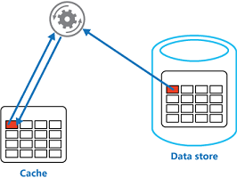

详细信息请点击缓存模式。

## 断路器模式
  

当我们连接一个远程服务或者资源时可能需要花费大量时间来处理错误。这种模式可以提高一个应用的稳定性和弹性。

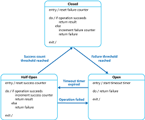

详细信息请点击断路器模式。

## 事务修正模式
  

在执行一个由许多步骤组成的拥有最终一致性操作的事务时，如果其中一步或者多步产生错误，我们就需要撤销这一系列操作。在云托管的应用程序中，为了完成复杂的业务和工作流程，操作往往需要遵循最终一致性模型。

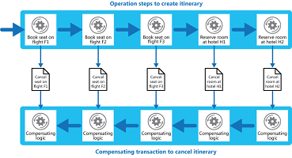

详细信息请点击事务修正模型。

## 消费者竞争模式
      

使用多个并行的消费者来处理同一个消息源发送的消息。为了提高扩展性和可用性，并平衡负载，使用这个模式能够使系统同时处理多种消息并优化吞吐量。

详细信息请点击消费者竞争模式.

## 计算资源整合模式
    

合并多个任务或者操作成为一个单一的计算单元。这种模式可以增加计算资源利用率，并且减少与云托管应用程序执行计算处理相关的成本和管理开销。

详细信息请点击计算资源整合模式.

## 命令查询职责分离（CQRS）模式
      

通过使用独立的接口来将读取数据操作和更新数据操作分离。这种模式可以最大化性能、可扩展性以及安全性；也支持随着时间演化为更高的灵活性；并防止域级别的更新操作造成的合并冲突。

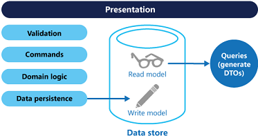

详细信息请点击命令查询职责分离（CQRS）模式.

## 事件溯源模式
    

使用一个只能追加的存储来记录完整的一系列用来描述域上数据所采取的动作的事件，这种做法往往比仅仅记录当前状态好的多，因为这种存储能用来物化域上的对象。这种模式能通过避免同步数据模型和业务域的需求来精简复杂域之间的任务；提高性能、可扩展性和响应速度；提高修正数据的一致性；并且保存完整的审查线索和历史以便于回溯动作。

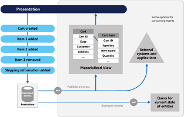

详细信息请点击事件溯源模式.

## External Configuration Store Pattern
      

Move configuration information out of the application deployment package to a centralized location. This pattern can provide opportunities for easier management and control of configuration data, and for sharing configuration data across applications and application instances.

详细信息请点击 the External Configuration Store Pattern.

## Federated Identity Pattern
  

Delegate authentication to an external identity provider. This pattern can simplify development, minimize the requirement for user administration, and improve the user experience of the application.

详细信息请点击 the Federated Identity Pattern.

## [门卫模式](10.Gatekeeper Pattern.md)
  

通过使用一个专门的主机实例作为客户端和应用程序之间的“中间人”来保护应用程序和服务，它可以进行验证，也可以过滤有问题的请求，并且在客户端和应用服务之间传递请求和数据。这种模式可以提供一个额外的安全层，并限制了系统的易受攻击的部分。

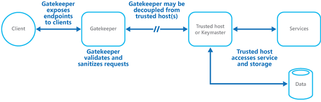

详细信息请点击[门卫模式](10.Gatekeeper Pattern.md)。

## [健康终端监控模式](11.Health Endpoint Monitoring Pattern.md)
      

外部工具可以定期地通过暴露的终端在应用程序中实施功能检测。这个模式可以帮助用户验证应用程序和服务正在正确地运行。

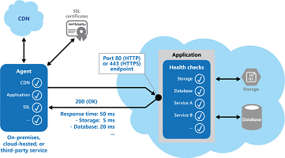

详细信息请点击[健康终端监控模式](11.Health Endpoint Monitoring Pattern.md)。

## Index Table Pattern
    

Create indexes over the fields in data stores that are frequently referenced by query criteria. This pattern can improve query performance by allowing applications to more quickly retrieve data from a data store.

详细信息请点击 the Index Table Pattern.

## Leader Election Pattern
      

Coordinate the actions performed by a collection of collaborating task instances in a distributed application by electing one instance as the leader that assumes responsibility for managing the other instances. This pattern can help to ensure that tasks do not conflict with each other, cause contention for shared resources, or inadvertently interfere with the work that other task instances are performing.

详细信息请点击 the Leader Election Pattern.

## Materialized View Pattern
    

Generate pre-populated views over the data in one or more data stores when the data is formatted in a way that does not favor the required query operations. This pattern can help to support efficient querying and data extraction, and improve application performance.

详细信息请点击 the Materialized View Pattern.

## Pipes and Filters Pattern
      

Decompose a task that performs complex processing into a series of discrete elements that can be reused. This pattern can improve performance, scalability, and reusability by allowing task elements that perform the processing to be deployed and scaled independently.

详细信息请点击 the Pipes and Filters Pattern.

## Priority Queue Pattern
      

Prioritize requests sent to services so that requests with a higher priority are received and processed more quickly than those of a lower priority. This pattern is useful in applications that offer different service level guarantees to individual types of client.

详细信息请点击 the Priority Queue Pattern.

## Queue-based Load Leveling Pattern
      

Use a queue that acts as a buffer between a task and a service that it invokes in order to smooth intermittent heavy loads that may otherwise cause the service to fail or the task to timeout. This pattern can help to minimize the impact of peaks in demand on availability and responsiveness for both the task and the service.

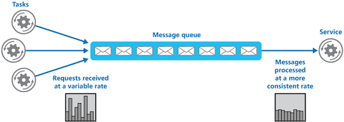

详细信息请点击 the Queue-based Load Leveling Pattern.

## Retry Pattern
  

Enable an application to handle temporary failures when connecting to a service or network resource by transparently retrying the operation in the expectation that the failure is transient. This pattern can improve the stability of the application.

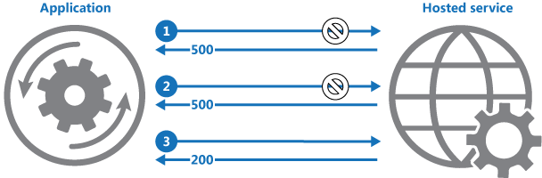

详细信息请点击 the Retry Pattern.

## Runtime Reconfiguration Pattern
      

Design an application so that it can be reconfigured without requiring redeployment or restarting the application. This helps to maintain availability and minimize downtime.

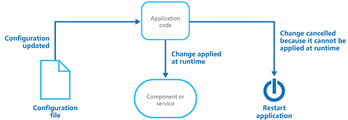

详细信息请点击 the Runtime Reconfiguration Pattern.

## Scheduler Agent Supervisor Pattern
    

Coordinate a set of actions across a distributed set of services and other remote resources, attempt to transparently handle faults if any of these actions fail, or undo the effects of the work performed if the system cannot recover from a fault. This pattern can add resiliency to a distributed system by enabling it to recover and retry actions that fail due to transient exceptions, long-lasting faults, and process failures.

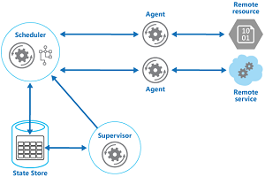

详细信息请点击 the Scheduler Agent Supervisor Pattern.

## Sharding Pattern
    

Divide a data store into a set of horizontal partitions shards. This pattern can improve scalability when storing and accessing large volumes of data.

详细信息请点击 the Sharding Pattern.

## Static Content Hosting Pattern
        

Deploy static content to a cloud-based storage service that can deliver these directly to the client. This pattern can reduce the requirement for potentially expensive compute instances.

详细信息请点击 the Static Content Hosting Pattern.

## Throttling Pattern
    

Control the consumption of resources used by an instance of an application, an individual tenant, or an entire service. This pattern can allow the system to continue to function and meet service level agreements, even when an increase in demand places an extreme load on resources.

详细信息请点击 the Throttling Pattern.

## Valet Key Pattern
      

Use a token or key that provides clients with restricted direct access to a specific resource or service in order to offload data transfer operations from the application code. This pattern is particularly useful in applications that use cloud-hosted storage systems or queues, and can minimize cost and maximize scalability and performance.

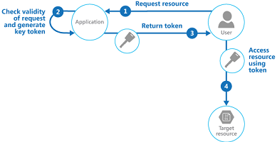

详细信息请点击 the Valet Key Pattern.

# Guidance
The primer and guidance topics are related to specific areas of application development, such as caching, data partitioning, and autoscaling. The guide contains the following primers and guidance topics.

## Asynchronous Messaging Primer
  

Messaging is a key strategy employed in many distributed environments such as the cloud. It enables applications and services to communicate and cooperate, and can help to build scalable and resilient solutions. Messaging supports asynchronous operations, enabling you to decouple a process that consumes a service from the process that implements the service.

详细信息请点击 Asynchronous Messaging Primer.

## Autoscaling Guidance
  

Constantly monitoring performance and scaling a system to adapt to fluctuating workloads to meet capacity targets and optimize operational cost can be a labor-intensive process. It may not be feasible to perform these tasks manually. This is where autoscaling is useful.

详细信息请点击 Autoscaling Guidance.

## Caching Guidance
    

Caching is a common technique that aims to improve the performance and scalability of a system by temporarily copying frequently accessed data to fast storage located close to the application. Caching is most effective when an application instance repeatedly reads the same data, especially if the original data store is slow relative to the speed of the cache, it is subject to a high level of contention, or it is far away resulting in network latency.

详细信息请点击 Caching Guidance.

## Compute Partitioning Guidance
  

When deploying an application to the cloud it may be desirable to allocate the services and components it uses in a way that helps to minimize running costs while maintaining the scalability, performance, availability, and security of the application.

详细信息请点击 Compute Partitioning Guidance.

## Data Consistency Primer
    

Cloud applications typically use data that is dispersed across data stores. Managing and maintaining data consistency in this environment can become a critical aspect of the system, particularly in terms of the concurrency and availability issues that can arise. You frequently need to trade strong consistency for performance. This means that you may need to design some aspects of your solutions around the notion of eventual consistency and accept that the data that your applications use might not be completely consistent all of the time.

详细信息请点击 Data Consistency Primer.

## Data Partitioning Guidance
    

In many large-scale solutions, data is divided into separate partitions that can be managed and accessed separately. The partitioning strategy must be chosen carefully to maximize the benefits while minimizing adverse effects. Partitioning can help to improve scalability, reduce contention, and optimize performance.

详细信息请点击 Data Partitioning Guidance.

## Data Replication and Synchronization Guidance
    

When you deploy an application to more than one datacenter, such as cloud and on-premises locations, you must consider how you will replicate and synchronize the data each instance of the application uses in order to maximize availability and performance, ensure consistency, and minimize data transfer costs between locations.

详细信息请点击 Data Replication and Synchronization Guidance.

## Instrumentation and Telemetry Guidance
  

Most applications will include diagnostics features that generate custom monitoring and debugging information, especially when an error occurs. This is referred to as instrumentation, and is usually implemented by adding event and error handling code to the application. The process of gathering remote information that is collected by instrumentation is usually referred to as telemetry.

详细信息请点击 Instrumentation and Telemetry Guidance.

## Multiple Datacenter Deployment Guidance
  

Deploying an application to more than one datacenter can provide benefits such as increased availability and a better user experience across wider geographical areas. However, there are challenges that must be resolved, such as data synchronization and regulatory limitations.

详细信息请点击 Multiple Datacenter Deployment Guidance.

## Service Metering Guidance
  

You may need to meter the use of applications or services in order to plan future requirements; to gain an understanding of how they are used; or to bill users, organization departments, or customers. This is a common requirement, particularly in large corporations and for independent software vendors and service providers.

详细信息请点击 Service Metering Guidance.

# See Also

* [Problem Areas in the Cloud](https://msdn.microsoft.com/en-us/library/dn589772.aspx)
* [Code Samples](https://msdn.microsoft.com/en-us/library/dn622075.aspx)

# Feedback and Support
Questions? Comments? Suggestions? To provide feedback about this guide, or to get help with any problems, please visit our Community site at [http://wag.codeplex.com](http://wag.codeplex.com). The message board on the community site is the preferred feedback and support channel because it allows you to share your ideas, questions, and solutions with the entire community.
